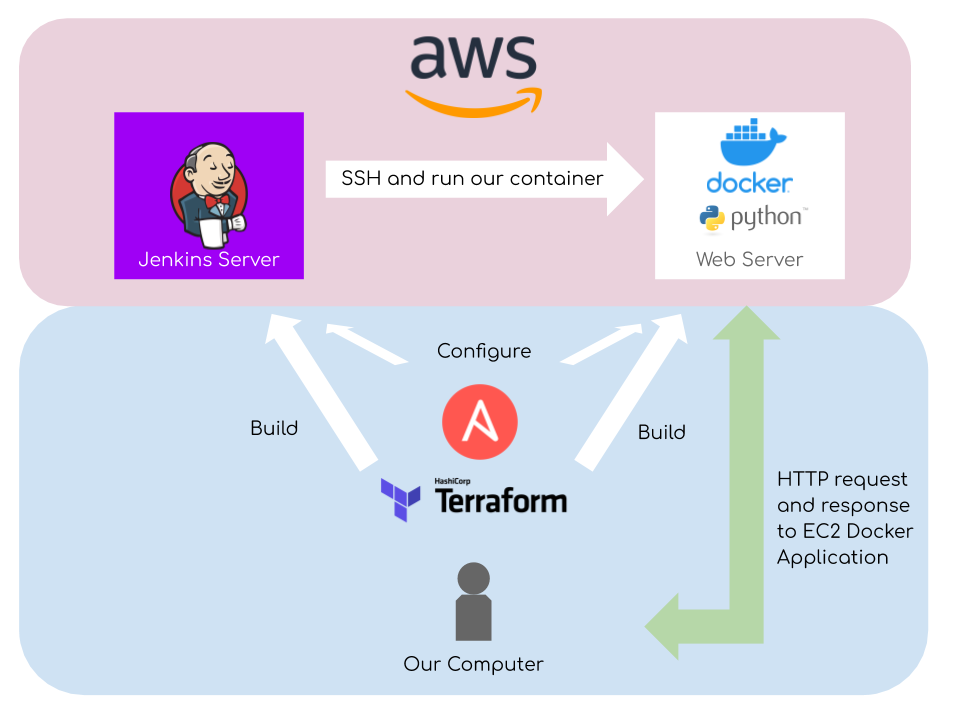

# Project Aims
- Have fun
- Gain practical experience using devops industry standard tools, namely:

    - Ansible
    - AWS
    - Docker
    - Jenkins
    - Terraform

# Project Objectives

- Provision infrastructure using Terraform onto AWS
- Use Ansible to configure infrastructure provisioned
- Jenkins to automate deploy of web application 
- Web application is created from a Docker image
---
# Project Infrastructure

In this project I provisioned two EC2 instances with Terraformed and then configured via Ansible Playbooks. The instances were used to host a web and jenkins server. The jenkins server was used to run a docker image via a shell script remotely using ssh.

# Areas of Improvemnt

- Use of Terraform modules
- Include security groups in Terraform instead of manually doing so in web portal.
- Use ECS instead of EC2 instances.

# Resources

[Terraform for Beginners](https://www.youtube.com/watch?v=SLB_c_ayRMo)

[Ansible Documentation](https://docs.ansible.com/ansible/latest/index.html)

[Docker Documentation](https://docs.docker.com/)

[Jenkins Installation - Ubuntu](https://www.jenkins.io/doc/book/installing/linux/)